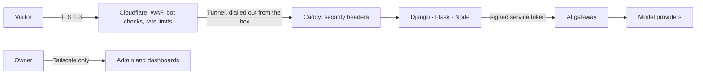

# Security architecture

Status: accepted · Rev E · 28 Sep 2026 · Owner: Landry

The site has **no accounts**: no sign-up, no login, no logout. Every visitor is
anonymous, and every protection below works without asking anyone who they are.
To report a vulnerability, see [`../SECURITY.md`](../SECURITY.md).

## Principles

1. **No accounts, no login surface.** There are no passwords, reset flows or user
   sessions to steal, because there are no users to impersonate.
2. **Zero inbound ports.** The server accepts no connections from the internet. It
   dials out to Cloudflare, and Cloudflare is the only way in.
3. **Least privilege.** Every service, database role, Redis user and storage token
   reaches only what it needs.
4. **The model is untrusted.** Its output is validated, never executed, and never
   allowed a real side effect.
5. **Nothing worth stealing.** Synthetic data only, uploads expire within hours, and
   IP addresses are never stored in the clear.

## Request path

## 1. Edge

- DNS and HTTPS through Cloudflare; the origin IP is never published.
- Cloudflare Tunnel: the box runs `cloudflared`, an outbound-only connector. There is
  no inbound firewall rule for HTTP or SSH.
- Cloudflare's free managed WAF rules, Bot Fight Mode, a rate-limiting rule on the API
  hostnames, and DDoS protection.
- TLS 1.3 and HSTS with preload.

## 2. Visitors without accounts

- **Anonymous session.** A random 128-bit ID in a signed cookie with the `__Host-`
  prefix, `HttpOnly`, `Secure` and `SameSite=Strict`, rotated daily. It exists only for
  quotas and abuse protection, so it is strictly necessary and needs no consent
  banner. The site sets no other cookies and loads no trackers. The visitor's theme
  choice stays in the browser's `localStorage`, and the language is part of the URL
  (`/cs` for Czech), so choosing one stores nothing.
- **Turnstile** in invisible mode before a visitor's first AI run. People never solve
  a puzzle; bots are stopped before they spend quota.
- **Short-lived tokens.** The Nuxt server's Nitro routes mint Ed25519-signed JWTs,
  valid for 5 minutes and scoped to one system, for SSE and WebSocket calls to the
  box. Their subject is a keyed hash of the session, never the cookie itself. The
  systems check each one against the site's public key and fail closed without it;
  `services/django-systems/core/visitors.py` specifies the claims.
- **Three rate-limit layers:** Cloudflare per IP, the gateway per session, and the
  gateway per system and per provider.
- **Private by design.** IP addresses are kept only as salted hashes, and the salt
  rotates daily.

## 3. Application

- **Content Security Policy** with per-request nonces and `strict-dynamic`, plus
  Trusted Types (`require-trusted-types-for 'script'`), so injected script can't run
  even if markup slips through. `nuxt-security` sets the headers and nonces. The only
  Trusted Types policy allowed is `vue`, which Vue creates for its own compiled
  markup.
- **Headers:** `frame-ancestors 'none'`, `Cross-Origin-Opener-Policy: same-origin`,
  `Cross-Origin-Resource-Policy: same-origin`,
  `Referrer-Policy: strict-origin-when-cross-origin`, `X-Content-Type-Options: nosniff`,
  and a `Permissions-Policy` that denies every device API except the microphone on
  the LB-09 page.
- **CSRF:** `SameSite=Strict` cookies plus an `Origin` check on every state-changing
  request.
- **Input and output:** Zod or Pydantic at every boundary. Vue escapes everything a
  template renders, and `v-html` is banned by lint (`vue/no-v-html`), so no visitor or
  model text is ever parsed as markup.
- **Uploads:** checked by magic bytes, size and page count; parsed in a worker with
  CPU, memory and time limits; stored in R2 under random keys; deleted by lifecycle
  rules.
- **Target:** A+ on Mozilla Observatory, checked in CI.

## 4. AI-specific risks

Mapped to the OWASP Top 10 for LLM applications:

| Risk | Control |
|---|---|
| Prompt injection | Prompt Guard 2 on visitor text, read in overlapping segments so nothing hides past its window, and failing closed without a verdict; untrusted content kept out of instruction slots; tools scoped per step |
| Insecure output handling | Structured output validated; model-written SQL parsed and allowlisted; charts are Vega-Lite data, never code |
| Excessive agency | No real side effects: sandboxed connectors, and a human click before any action |
| Sensitive data disclosure | Synthetic data; visitor content routed only to providers that don't train on inputs |
| Model denial of service | Per-run call caps, per-visitor and per-system quotas, token-aware provider budgets, replay mode |
| Supply chain | Model IDs pinned in `routing.yaml`; the eval gate runs before any change |
| System prompt leakage | No secrets or internal URLs in prompts |

Eval Lab keeps a red-team golden set of injections, jailbreaks and exfiltration
attempts. Every prompt change must pass it.

## 5. Services and data

- **Segmented networks.** Docker networks `edge` (cloudflared, Caddy), `app` (gateway
  and systems), `data` (Postgres, Redis) and `sandbox` (Playwright worker, staging
  shop). The data network has no route to the internet.
- **Allowlisted egress.** Outbound traffic goes through an egress proxy with a domain
  allowlist: the gateway may reach the model providers, the systems may reach R2 and
  Sentry, and nothing else leaves the box except the tunnel.
- **Service tokens.** Each service signs short-lived JWTs (EdDSA) with its own private
  key; the gateway holds only the public keys, refuses tokens older than 10 minutes,
  ties each system to one service, and rejects everything else. A service refuses a
  key file other users could read, and its gateway client never follows a redirect or
  a proxy setting, so a token can't be sent anywhere but the gateway. Provider keys
  exist only in the gateway. Without Redis the gateway can't check a budget, so it
  fails closed.
- **Postgres:** one role per system, granted only its own schema; the gateway's role
  sees only `platform`.
- **Redis:** one ACL user per service, limited to its key prefix, with dangerous
  commands disabled.
- **R2:** one scoped token per bucket.
- **Backups:** a nightly `pg_dump`, encrypted with age before it leaves the box.

## 6. Containers and host

- **Images:** pinned by digest, slim or distroless bases, non-root users, read-only
  root filesystems, `cap_drop: [ALL]`, `no-new-privileges`, and PID, CPU and memory
  limits.
- **Browser sandbox:** the LB-07 Playwright worker runs under gVisor, and its network
  reaches only the staging shop.
- **Host:** an Oracle Cloud Always Free VM running Ubuntu LTS, with unattended
  security upgrades, no password logins, and SSH reachable only over Tailscale.
  Oracle's default VCN security list opens SSH (port 22) to the internet. That rule is
  deleted once Tailscale is up, so the security list admits no inbound traffic and the
  host firewall drops anything that doesn't arrive over Tailscale.
- **Owner tools** (Django admin, dashboards) listen only on the Tailscale network. The
  public internet has no admin page and no login page.

## 7. Supply chain and delivery

- **Secrets:** encrypted in the repository with SOPS and age, and decrypted only on
  the box at deploy time.
- **CI:** GitHub Actions pinned by commit SHA, a least-privilege `GITHUB_TOKEN`, and
  OIDC instead of long-lived cloud keys. Deploys reach the box through an ephemeral
  Tailscale node.
- **Every image** gets an SBOM (Syft), a Trivy scan, a build-provenance attestation
  and a keyless cosign signature. The box verifies the signature before it runs the
  image.
- **Every change** is linted with eslint-plugin-security (no eval-like code, no regexes
  built from strings, no hidden bidirectional Unicode) and eslint-plugin-regexp (no
  regexes open to catastrophic backtracking), and CI fails on any high or critical
  advisory from `pnpm audit`.
- **Every pull request** runs CodeQL and Semgrep on the code, gitleaks for secrets,
  pip-audit and pnpm audit on dependencies, and an OWASP ZAP baseline scan against the
  full stack started in CI.
- **Renovate** keeps dependencies current, and security updates merge first.

## 8. Detection and response

- Sentry for errors, Cloudflare security events, and gateway alerts on quota
  anomalies and repeated guard hits.
- An append-only audit table records every human-approved action and every blocked
  request type.
- Runbook: block at the edge, rotate the affected key, switch systems to replay mode,
  rebuild from seed.
- `/.well-known/security.txt` points to the disclosure policy.
