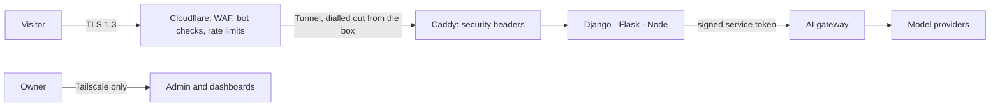

# Security architecture

Status: accepted · Rev E · 28 Sep 2026 · Owner: Landry

The site has **no accounts**: no sign-up, no login, no logout. Every visitor is
anonymous, and every protection below works without asking anyone who they are.
To report a vulnerability, see [`../SECURITY.md`](../SECURITY.md).

## Principles

1. **No accounts, no login surface.** There are no passwords, reset flows or user
   sessions to steal, because there are no users to impersonate.
2. **Zero inbound ports.** The server accepts no connections from the internet. It
   dials out to Cloudflare, and Cloudflare is the only way in.
3. **Least privilege.** Every service, database role, Redis user and storage token
   reaches only what it needs.
4. **The model is untrusted.** Its output is validated, never executed, and never
   allowed a real side effect.
5. **Nothing worth stealing.** Synthetic data only, uploads expire within hours, and
   IP addresses are never stored in the clear.

## Request path

## 1. Edge

- DNS and HTTPS through Cloudflare; the origin IP is never published.
- Cloudflare Tunnel: the box runs `cloudflared`, an outbound-only connector. There is
  no inbound firewall rule for HTTP or SSH.
- Cloudflare's free managed WAF rules, a per-IP rate-limiting rule on the WebSocket path of
  the API hostname only (`/ws/`, where the address is the visitor's own), and DDoS
  protection. There is deliberately no per-IP rule for the rest of the API hostname: the
  site's server relays every visitor's call from Vercel's addresses, which all visitors
  share, so such a rule would see the site and let one visitor block it for everyone. For the
  same reason Bot Fight Mode stays off: the caller it would judge is the site's server, and
  the free plan cannot exempt it. [`docs/DEPLOY.md`](DEPLOY.md), part 5, says what to use
  instead.
- TLS 1.3 and HSTS with preload.

## 2. Visitors without accounts

- **Anonymous session.** A random 128-bit ID in a signed cookie with the `__Host-`
  prefix, `HttpOnly`, `Secure` and `SameSite=Strict`, rotated daily. It exists only for
  quotas and abuse protection, so it is strictly necessary and needs no consent
  banner. The site sets no other cookies and loads no trackers. The visitor's theme
  choice stays in the browser's `localStorage`, and the language is part of the URL
  (`/cs` for Czech), so choosing one stores nothing.
- **Turnstile** in invisible mode before a visitor's first AI run. People never solve
  a puzzle; bots are stopped before they spend quota.
- **Short-lived tokens.** The Nuxt server's Nitro routes mint Ed25519-signed JWTs,
  valid for 5 minutes and scoped to one system, for SSE and WebSocket calls to the
  box. Their subject is a keyed hash of the session, never the cookie itself. The
  systems check each one against the site's public key and fail closed without it.
  The claims are specified by `packages/common/src/visitors.ts` and
  `python/lb-common/src/lb_common/visitors.py`, which the Node, Django and Flask systems
  all use, and which accept and refuse exactly the same tokens: both are strict (one
  spelling for the text, plain JSON values only, whole-second times), and one corpus of
  signed tokens with the verdict each must get
  (`packages/common/test/fixtures/visitor-tokens.json`, made by
  `just visitor-tokens`, kept fresh by `just check`) is run by the tests of both and of
  every system's own authentication.
- **Three rate-limit layers:** Cloudflare per IP, for what visitors send straight to the API
  hostname (LB-02's WebSocket); the systems' and the gateway's quotas per session, for everything
  the site relays, since the API sees the site's addresses and not the visitor's; and the gateway
  per system and per provider.
- **Private by design.** IP addresses are kept only as salted hashes, and the salt
  rotates daily.

### What the site's server does

The Nuxt server (Nitro routes in `apps/web/server`) is the only thing a visitor's browser
talks to for data. It holds the site's secrets (the signing key for visitor tokens, the
`web` service key, the Turnstile secret and the session secret: the `NUXT_LB_*` variables
of [`docs/DEPLOY.md`](DEPLOY.md), part 10), checks them with Zod at startup, and refuses to
start when some are set and any is wrong, naming the variable and never its value. With none
set it serves the catalog and the datasheets and answers every demo route with 503, which is
how a Vercel preview runs.

- **One address.** The session cookie belongs to one host and the quotas follow the session, so
  `www.` and the `*.vercel.app` addresses of the production deployment would each be a site of
  their own, with a quota of their own for the same person. With `NUXT_LB_SITE_ORIGIN` set (the
  site's one address, `https://example.com`), the server's first middleware answers a request made
  for any other host with a `308` to the same path and query on that origin, before it reads a
  cookie, calls a back end or renders a page (`server/lib/site-middleware.ts`). The host is the one
  Vercel reports in `X-Forwarded-Host`, which Vercel sets itself and which the Origin and
  Turnstile-hostname checks trust too. The redirect repeats the request as it was written, only
  ever after the configured origin and only if it is printable ASCII, so nothing in a request can
  choose where a visitor goes; it is never cached, and carries HSTS and the other plain
  security headers. The same middleware gives every path under `/api` its services, the bare `/api`
  included, so it answers the API's own 404 like `/api/`. A site with the variable unset (a preview)
  answers on any host.
- **Session.** A call to `GET /api/session` creates the visitor's session the first time and
  says whether this deployment has a back end, whether the Turnstile check has passed today
  and when the day's quotas turn over. The cookie is `__Host-lb_session`, worth
  `v1.<payload>.<signature>`: the payload holds a random 128-bit ID, the UTC date it was
  made and the "verified" flag, and the signature is an HMAC-SHA-256 under a key derived
  (HKDF) from `NUXT_LB_SESSION_SECRET`. A cookie the server did not sign, or one from
  another day, is ignored and replaced by a fresh session, so a visitor cannot choose their
  own ID (session fixation), and a day's verification does not carry past midnight UTC, where
  the quotas turn over too. The subject of a visitor token is a second keyed hash of the ID,
  derived under a different key, so a token never shows the cookie's ID. Pages set no cookie:
  only a call to `/api/*` creates a session.
- **Turnstile.** `POST /api/session/verify` sends the widget's token to Cloudflare's
  `siteverify` with the secret key and checks the hostname; a pass sets the "verified" flag in
  the cookie for the rest of the day. Every request to a back end that is not a read needs the
  flag, or it is answered 403 `verification_required`. The widget loads only when a visitor
  starts a live run (never for the catalog, a datasheet, a replay or a trace), from
  `challenges.cloudflare.com`, and its script's address is made by one named Trusted Types
  policy, `lb-turnstile`, that hands out that address and no other. The test build accepts a
  fixed stand-in token instead of the widget's; the stand-in is compiled out of the production
  bundle, and `just check-build` (run in CI) fails if any trace of it is left there. CI cannot
  see a build made on Vercel, so that build refuses by itself: with `VERCEL` set, `LB_TEST_BUILD=1`
  stops `nuxt build` at once (`shared/build-mode.ts`, read by `nuxt.config.ts`), and a server
  that was built as a test build refuses to start where `VERCEL` is set
  (`server/lib/config.ts`), with settings or without. Both are tested.
- **The proxy.** `/api/lb01/...`, `/api/lb02/...`, `/api/lb03/...`, `/api/lb04/...`, `/api/lb05/...`, `/api/lb06/...`, `/api/lb07/...`, `/api/lb08/...`, `/api/lb09/...` and `/api/lb10/...`
  forward a visitor's call to that system with a visitor token the server signs (EdDSA,
  5 minutes, the system as audience, the keyed hash as subject). Only the routes in the back
  ends' committed OpenAPI documents are forwarded, with the methods those documents give
  (`packages/api-clients` generates the table, and `pnpm check` fails when it is stale);
  anything else is a 404 from the site, and the back end never sees it.
- **The Scope's route.** `GET /api/runs/{id}/spans` reads a run's trace from the gateway with
  the `web` service token (a permission that cannot call a model, see "Service tokens") and
  hands the page on after checking it with the span schema. A trace holds names, timings,
  models and token counts, never what was typed or answered, and expires within a day, so
  whoever has a run's ID (8 to 64 unguessable characters) may read it: that is what makes a
  permalink possible, and why it needs no session. A read of a full page costs the gateway about
  10 ms of CPU, so the route is bounded twice: the site keeps a page for a second, and readers
  who ask while it is fetched share the fetch (`server/lib/trace-cache.ts`, so a Scope or any number
  of viewers of one trace cost the gateway one read of each page a second), and the gateway counts
  the reads of each run on its own and answers 429 `rate_limited` past a burst of 20 and 5 a second
  (`services/gateway/src/read-limit.ts`), however the page is asked for. A Scope polls about twice a
  second and a permalink pages through a long trace in a few reads, so neither comes near it. A
  flood across many run IDs the visitor has is bounded by what it takes to start those runs.
- **Recordings.** `GET /api/recordings/{system}[/{sample}]` serves the recordings of the
  curated samples, which are bundled with the site, checked with their schema on every read and
  looked up by a name that must match `[a-z0-9-]{1,60}`. Only a recording whose `origin` is
  `live` is served; one made on the test mock is refused, except by the end-to-end build, which
  needs it to drive the replay player.
- **LB-02's board: the WebSocket and the installable app.** A Vercel function cannot hold a
  WebSocket, so the conversation connects from the visitor's browser straight to the API.
  `POST /api/tokens/lb-02` gives the page a five-minute grant and the socket's address, taken
  from the same setting (`NUXT_LB_API_URL`) the proxy uses; the token goes in the connection's
  first frame, never in an address, and the page refuses an address that is not `ws:` or
  `wss:` or that carries credentials. Only LB-02's two board pages (English and Czech) get a
  longer Content Security Policy, and each addition is the smallest that works: `connect-src`
  gains the API's `ws(s)://host` (no wildcard), `trusted-types` gains `lb-service-worker`, the
  one policy that makes the service worker's address and hands out no other (there is never a
  `default` policy), and `worker-src 'self'`. The additions are made when the server starts
  (`apps/web/server/lib/lb02-csp.ts`) and are tested against the headers a browser gets
  (`apps/web/e2e/security.spec.ts`). The service worker (`apps/web/public/lb02-sw.js`) keeps the
  board's two pages (no query) and the content-named static files of the build, the app's icon
  and its manifests, so the app opens without a connection, and nothing else: it looks only at
  same-origin GET requests answered 200, refuses `/api/` by name, never keeps a token, a
  conversation, the calendar or a recording, and a WebSocket does not pass through a service
  worker at all. The page is fetched from the network first, so a visitor who is online always
  gets the current page. A test fails if the worker ever stores an API or WebSocket address.
- **LB-06's board: the feed.** The incident's feed, like LB-02's conversation, connects from the
  visitor's browser straight to the API: `POST /api/tokens/lb-06` gives the page a five-minute
  grant and the socket's address, from the same setting the proxy uses, the token goes in the
  first frame and never in an address, and the page refuses an address that is not `ws:` or `wss:`
  or that carries credentials. Only LB-06's two board pages get a longer policy, and the one
  addition is the smallest that works: `connect-src` gains the API's `ws(s)://host` (no wildcard).
  Nothing else changes: no service worker, no Web Worker, no new Trusted Types policy
  (`apps/web/server/lib/lb06-csp.ts`, tested in `test/unit/lb06-csp.test.ts` and against the headers
  a browser gets in `e2e/security.spec.ts`). The page polls the events route when the socket drops.
- **LB-04's board: the PDF viewer.** The viewer draws a contract's PDF with pdf.js
  (`pdfjs-dist`), loaded only when a visitor asks to see the pages (the build leaves it out of
  the page's prefetch hints), and only from the site's own origin. pdf.js works in a Web Worker,
  and a worker's address is a script address, so under `require-trusted-types-for 'script'` the
  page cannot start one from a string. Only LB-04's two board pages (English and Czech) get a
  longer Content Security Policy, and each addition is the smallest that works: `trusted-types`
  gains `lb-pdf-worker`, one policy whose rule throws for every address but the worker file's
  own (there is never a `default` policy, and no `allow-duplicates`), and `worker-src 'self'`.
  Nothing else changes: `script-src` keeps its nonce and `strict-dynamic`, and `connect-src`,
  `font-src` and `img-src` stay as they are. pdf.js 6 evaluates no code, so there is no
  `unsafe-eval` or `wasm-unsafe-eval`; it loads no script, font, image or style from anywhere
  (the bytes are the ones the board already holds, and fonts that are not in the PDF are the
  system's), and the viewer opens a PDF with XFA off. The additions are made when the server
  starts (`apps/web/server/lib/lb04-csp.ts`), unit-tested for what they add and for what they
  leave alone (`apps/web/test/unit/lb04-viewer-policy.test.ts`), and tested against the headers
  and a real Chromium (`apps/web/e2e/lb04.spec.ts`): the worker is requested from the site's own
  origin and only after the pages are asked for, the page can start no other worker and make no
  policy of its own (the browser's own reports of each refusal are asserted), and no other page
  carries either addition. A visitor's PDF is a stranger's file, and it is parsed twice without
  trust in either: on the server in a worker thread with a deadline and a memory limit (section
  5), and in the browser inside pdf.js's worker. The viewer draws a highlight only on a page where
  the browser's pdf.js read exactly the text the server's did (both build the text with the same
  function, `extractPageText` in `@lb/contracts`, and the viewer compares them page by page); on a
  page where they differ it leaves the highlight off and says so, and the passage is still shown
  as text. That the two agree is checked in a browser on every sample the system can review, not
  assumed for a visitor's own file.
- **LB-07's board: the screenshots.** LB-07's service answers a screenshot of its sandboxed
  browser as base64 inside JSON. The board does not turn that into a `blob:` or `data:` address
  of its own, which would need the policy widened; the site answers each screenshot at an address
  of its own, `GET /api/lb07/runs/{id}/evidence/{evidenceId}/image`, so a plain `` to the
  site's origin shows it and the policy stays as it is (`apps/web/server/handlers/lb07-evidence-image.ts`).
  The route checks both ids by their pattern (a UUID, and `e` with up to three digits), reads the
  evidence through the same call the proxy makes (the visitor's token for `lb-07`, so a run that
  is not the visitor's, or is gone, is the service's own 404, as it is for the proxy), and answers
  only a piece that fits the evidence schema, is of kind `screenshot`, decodes cleanly, starts with
  the PNG signature and is at most 400 kB (the contract's limit). A page's tree, which is text, is a
  404; anything else is a 502 in the platform's error shape. A picture is answered as `image/png`
  with `nosniff` and `no-store`. A replay's screenshots come from the recording and are shown as
  `data:image/png` addresses, which the site's policy already allows (`img-src 'self' data:`), and
  only after the browser has checked their PNG signature. The policy is not changed for LB-07.

### Threat model of the proxy

| Threat | Control |
|---|---|
| SSRF: a visitor makes the server call somewhere else | The address is the configured origin plus a path the route table matched, and is checked to still be that origin before the call. A path parameter may hold only `[\w-]{1,64}` and a query value `[\w.:-]{1,64}`, so no dot segment, escape, slash or space reaches a back end. A redirect is never followed: a 3xx is a failure |
| Request smuggling and desync | The visitor's bytes are never forwarded. The body is read with a size cap per system (the `Content-Length` is checked before a byte is read, and a chunked body is counted as it arrives), must be JSON, is parsed and written again, and the request to the back end is made with fixed headers only: the token, an `accept` and a JSON content type. Node's HTTP parser refuses conflicting or repeated length headers before any handler runs |
| Token leakage | A visitor token is made per call, lives 5 minutes and never reaches the browser. The one exception is LB-02's WebSocket, whose grant goes in the connection's first frame and never in an address. Errors name the rule that was broken and never repeat a value, the server logs an unexpected error by its name and route and never its message or stack, every answer is `no-store`, and no CORS header is ever sent |
| A back end, or something between, answering with more than it should | An answer must be JSON within a size limit and a deadline, with a status from a short list; an error is passed on only in the platform's error shape and only with the fields that shape allows (LB-10's refusal of a prompt adds a list of at most ten problems, each a code and a sentence of at most 500 characters, and nothing else), so a stack trace, an HTML page or a database message becomes a generic failure. Only `Retry-After` goes back as a header, and never a cookie |
| CSRF | `SameSite=Strict` on the cookie, plus an `Origin` check on every request that changes anything (the origin must be the site's own, and `Sec-Fetch-Site` must say `same-origin` when a browser sends it), and no CORS, so no other site can read an answer |
| Session fixation and forgery | A cookie the server did not sign is replaced, never adopted; a visitor cannot choose an ID, and there is no login to fix a session to |
| Quota evasion by clearing cookies | A new cookie is a new session, with a fresh daily quota: the daily limits are per session because there are no accounts. What bounds a visitor who keeps clearing it is the Turnstile check before the first live run and the gateway's per-system and per-provider budgets, which cap total spend however many sessions ask. See the known gaps |
| Body bombs and slow requests | A size cap and a deadline for each system (`apps/web/server/lib/policy.ts`), set a little above what the system itself allows |
| Markup in what the models write or a visitor types | Everything is rendered as text by Vue, `v-html` is banned by lint, and the site's API accepts a ticket that quotes a tag so the system can be tried with it (the XSS filter of `nuxt-security` is off for `/api/**`, where it would read the body first and refuse what a demo invites visitors to try) |

### Known gaps

- **Clearing cookies resets a session's quota.** See the threat model: the daily limits are
  per session, so a determined visitor can spend more than their share until the gateway's
  budgets stop them.
- **There is no per-IP limit on what the site relays, on purpose.** The site's server calls the
  API from its host (Vercel), so anything Cloudflare counts per IP on the API hostname is the
  site's addresses, shared by every visitor: a per-IP rule there lets one visitor block the site
  for everyone. So the per-IP rule is scoped to the WebSocket path, which visitors' browsers
  reach directly, and what the site relays is bounded by the Turnstile check, the per-session
  quotas, the gateway's budgets and its limit on how often one run's trace is read. A per-IP
  limit on relayed traffic belongs where the visitor's address is visible, on the site
  (Vercel's Firewall), not on the API hostname behind it; the site's own server has no limiter
  of its own on purpose, since one per serverless instance would not see all requests.
- **LB-09's board records with the microphone and follows a meeting over the API's
  WebSocket.** Only its two board pages (English and Czech) differ from the rest of the site,
  and each addition is the smallest that works (`apps/web/server/lib/lb09-policy.ts`, tested
  in `apps/web/e2e/security.spec.ts`): `connect-src` gains the API's `ws(s)://host` (no
  wildcard), the grant coming from `POST /api/tokens/lb-09` exactly as LB-02's does;
  `media-src` is `'self' blob:`, because the visitor's own recording is played back from the
  browser's memory and never from the back end, which deletes the audio once transcribed
  (`blob:` is a media source only: scripts, workers and frames keep the site's policy); and
  the `Permissions-Policy` allows `microphone=(self)` on these two pages alone, with every
  other device API still denied and every other page keeping `microphone=()`. The page asks
  for the microphone only when the visitor presses record, after saying what will happen, and
  the audio stays in the page until the visitor sends it.
- **The real Turnstile widget has been run under this policy only with Cloudflare's test
  keys.** The production build, in a real browser, loaded the widget's script through the
  Trusted Types policy, rendered its frame, got a token and had the server's check with
  Cloudflare accept it, with no Content Security Policy or Trusted Types violation. Chrome
  logs one console message, because the widget's frame asks for `fullscreen`, which the
  Permissions-Policy denies; the widget works without it. Not exercised: a real site key and
  secret, a real challenge, and the hostname check against a real hostname (Cloudflare's test
  secret says tokens were solved on `example.com`, so the test served the site as that host).
  The first deployment still needs one manual pass: open a board, start a live run, and check
  the console.
- **Long calls on a serverless host.** LB-05 and LB-08 answer within 90 seconds, and the
  site's proxy waits 95 for them (`policy.ts`); whether the Vercel plan in use lets a function
  run that long has not been checked. If it does not, those two boards must poll.

## 3. Application

- **Content Security Policy** with per-request nonces and `strict-dynamic`, plus
  Trusted Types (`require-trusted-types-for 'script'`), so injected script can't run
  even if markup slips through. `nuxt-security` sets the headers and nonces. The only
  Trusted Types policy allowed is `vue`, which Vue creates for its own compiled
  markup; the evaluation boards' pages alone add `lb-turnstile` (see "What the site's
  server does") and Cloudflare's frame, LB-02's two board pages add `lb-service-worker`,
  `worker-src 'self'` and the API's WebSocket origin to `connect-src`, LB-04's two board
  pages add `lb-pdf-worker` and `worker-src 'self'`, and LB-09's two add the WebSocket origin
  and `media-src 'self' blob:` (all in the same section), and
  nothing else changes. Zod is told not to build
  its parsers with `new Function` (`apps/web/app/plugins/00.zod-jitless.ts`): the policy
  would report each probe as a violation.
- **Headers:** `frame-ancestors 'none'`, `Cross-Origin-Opener-Policy: same-origin`,
  `Cross-Origin-Resource-Policy: same-origin`,
  `Referrer-Policy: strict-origin-when-cross-origin`, `X-Content-Type-Options: nosniff`,
  and a `Permissions-Policy` that denies every device API except the microphone on
  LB-09's two board pages, which also allow `blob:` media and the API's WebSocket (see
  "What the site's server does").
- **CSRF:** `SameSite=Strict` cookies plus an `Origin` check on every state-changing
  request.
- **Input and output:** Zod or Pydantic at every boundary. Vue escapes everything a
  template renders, and `v-html` is banned by lint (`vue/no-v-html`), so no visitor or
  model text is ever parsed as markup.
- **Uploads (LB-03):** the length must be declared and is checked before a byte is read;
  the first bytes decide what a file is, never its name or the type the browser claims;
  the web process never decodes it. A worker process does, after it has put up a cage
  (CPU, memory, file and time limits, no new privileges, a seccomp filter with no sockets
  and no programs to start, Landlock where the kernel has it) and proved it holds, and the
  page count and pixel count are checked before a page is drawn. Files are stored privately
  under random keys, in R2 or on disk, and are never served back: a visitor sees only the
  page pictures the service drew from them. The service deletes them at their hour itself,
  since R2's lifecycle rules work in whole days and are only the backstop. The threat model
  is in `services/flask-systems/README.md`.
  LB-04's contract upload keeps its PDF in Postgres for an hour instead (see section 5), and
  Caddy gives that one route a larger body limit (3 MB, for a 2 MB PDF as base64 inside JSON)
  while every other route but LB-03's upload keeps 1 MB.
- **Target:** A+ on Mozilla Observatory, checked in CI.

## 4. AI-specific risks

Mapped to the OWASP Top 10 for LLM applications:

| Risk | Control |
|---|---|
| Prompt injection | Prompt Guard 2 on visitor text, read in overlapping segments so nothing hides past its window, and failing closed without a verdict; untrusted content kept out of instruction slots (a document's text sits in a data slot whose markers carry a code made for that document); tools scoped per step; and where a model reads a document, code checks what it said (LB-03's arithmetic) |
| Insecure output handling | Structured output validated; model-written SQL parsed and allowlisted; charts are Vega-Lite data, never code; an exported spreadsheet cell that begins like a formula is written as text |
| Excessive agency | No real side effects: sandboxed connectors, and a human click before any action |
| Sensitive data disclosure | Synthetic data; visitor content routed only to providers that don't train on inputs |
| Model denial of service | Per-run call caps, per-visitor and per-system quotas, token-aware provider budgets, replay mode |
| Supply chain | Model IDs pinned in `routing.yaml`; the eval gate runs before any change |
| System prompt leakage | No secrets or internal URLs in prompts |

Eval Lab keeps a red-team golden set of injections, jailbreaks and exfiltration
attempts. Every prompt change must pass it.

## 5. Services and data

- **Segmented networks.** Docker networks `edge` (cloudflared, Caddy), `app` (gateway
  and systems), `data` (Postgres, Redis) and `sandbox` (LB-07's browser sandbox, and the Node
  worker that calls its runner). The data network has no route to the internet. Neither has
  `edge`, `app` or `sandbox`, nor the network of either egress proxy: one `outbound` network has
  a route out, and only the two proxies and the tunnel connector join it. The `sandbox` network
  also gives the host no address: an internal network's gateway address is the host's own, and
  through it a container would reach whatever the host listens on (section 6).
- **Allowlisted egress.** Outbound traffic goes through an egress proxy with a domain
  allowlist: the gateway may reach the model providers, the systems may reach R2 and
  Sentry, and nothing else leaves the box except the tunnel. There are two Squid
  proxies, one for the gateway and one for the systems, each reachable only from its
  caller's network, so one list never has to serve both; they allow HTTPS CONNECT to
  the listed hosts and refuse everything else.
- **Service tokens.** Each service signs short-lived JWTs (EdDSA) with its own private
  key; the gateway holds only the public keys, refuses tokens older than 10 minutes,
  ties each system to one service, and rejects everything else. The site's server has a
  token of its own, `web`, with one permission: it reads a run's trace for the Scope
  (`GET /v1/runs/{id}/spans`, metadata only, for the systems `routing.yaml` lists under
  `traceReaders`). It owns no system, so it cannot call a model, and no service that does
  call models may read traces: `pnpm check` refuses a routing table that lets one service
  do both. A service refuses a
  key file other users could read, and its gateway client never follows a redirect or
  a proxy setting, so a token can't be sent anywhere but the gateway. Provider keys
  exist only in the gateway. Without Redis the gateway can't check a budget, so it
  fails closed.
- **Postgres:** one role per system (LB-01 to LB-08 so far), granted only
  its own schema and the shared `extensions` schema (pgvector, btree_gist: an extension
  object, not data); the gateway's role sees only `platform`. The superuser can log in
  only over the container's own socket, and every deploy re-applies the roles and
  passwords, so a role is never created by hand. `infra/postgres/test-roles.sh` proves,
  for every pair of systems, that one role cannot read, write, create in or drop
  another's schema.
- **Redis:** one ACL user per service, limited to its key prefixes, with dangerous
  commands disabled: the gateway's meters, the Django systems' Celery queue and LB-02's
  channel layer, the Node systems' BullMQ queues (LB-08's, LB-04's, LB-06's and LB-07's, each
  under its own pattern) and LB-06's feeds (a stream per incident), and for every service its
  own run spans; LB-07's browser sandbox has no Redis login at all. The ACL was derived from what
  the services run, and `infra/redis/test-acl.sh`
  runs their own test suites against it (the gateway's, lb-common's, LB-02's WebSocket
  consumers, LB-05's, the Node systems' (LB-08's, LB-04's, LB-06's and LB-07's), and a Celery worker) and then checks that Redis's ACL
  log is empty. It also tries every service on every other service's keys.
- **LB-05's data:** the DuckDB warehouse is generated into a volume by a one-shot job
  that has no network, no secret and no database, and the API mounts that volume
  read-only: a compromised API cannot change the data it answers from. The volume holds
  nothing but synthetic data, is not backed up, and is made again when it is missing.
- **WebSockets** (LB-02's at `/ws/lb02/`, LB-06's at `/ws/lb06/`): only the site's origin may
  open one (Caddy checks it, and answers `403` to the rest), the visitor token travels in the
  first frame and never in the address, uvicorn refuses a frame over 8192 bytes before LB-02
  reads it and Fastify one over 4096 before LB-06 does, and LB-06 holds a visitor to four
  connections and a process to 256, pings every half minute and closes after fifteen minutes
  of silence (`services/node-systems/src/modules/lb06/engine/socket.ts`).
- **R2:** one scoped token per bucket. LB-03's uploads bucket is private (nothing sets an ACL
  or makes a public address), its token may read, write and delete there and nowhere else,
  and its one-day lifecycle rule is a backstop behind the service's own hourly sweep.
- **Backups:** a nightly `pg_dump`, encrypted with age before it leaves the box, to
  public keys whose private halves stay off the box: a stolen box cannot read its own
  backups. The dump has the shape of LB-04's contract tables and none of their rows (the
  contract with the name of the file the visitor chose, the PDF, its text, the report and
  the redlines): a visitor's file is kept for an hour, and a backup is kept for weeks, so
  no backup may hold it. `infra/postgres/test-roles.sh` proves that no word of a contract
  is in the dump.
- **LB-04's contracts:** the PDF's bytes are stored in Postgres (the `lb04` schema, under
  its own role) for an hour and no longer: every row that belongs to a contract references
  it and cascades, a sweep deletes the expired every minute, a contract is not found once its hour
  is up even before the sweep, a failed review deletes its file and text at once, and the
  visitor can delete a contract early. The file is opened only in a worker thread with no
  environment, no flags and its own heap limits, which a deadline ends, and the model
  never sees a passage that talks to it. Its limits and what is not covered are in
  [`services/node-systems/README.md`](../services/node-systems/README.md), "Threat model of
  LB-04".
- **LB-06's incidents:** the visitor's two strings (a version label, a flag's name, 40
  characters each from a pattern with no `<` or `>`) go to the injection screen first and then
  into a delimited data slot of the agents' prompts, never into a system prompt; the agents
  can only cite evidence the server holds and propose an action from a closed list, and nothing
  changes the simulated shop without the visitor's click, which is a server-side transition
  checked against the pending proposal's id. An incident, its log and the scenario cache live in
  the `lb06` schema under their own role for a day, are left out of the backup, and are deleted
  by a sweep. The rest is in the same README, "LB-06 threat model".
- **LB-07's test runs:** the visitor's goal and everything made from it (the plan's steps, the
  findings, the screenshots and page snapshots, the report and its generated test) live in the
  `lb07` schema under its own role for an hour, are left out of the backup
  (`infra/backup/excluded-data.txt`; `infra/postgres/test-roles.sh` proves no word of a goal is
  in the dump), and are deleted by a sweep. The browser that runs the plan is in a container of
  its own (section 6).

## 6. Containers and host

- **Images:** pinned by digest, slim or distroless bases, non-root users, read-only
  root filesystems, `cap_drop: [ALL]`, `no-new-privileges`, and PID, CPU and memory
  limits. CI holds every service block to these rules (`infra/scripts/check-compose.sh`),
  so a new service cannot quietly weaken them, and no service publishes a port.
- **Browser sandbox (LB-07).** A headless Chromium, driven by a plan a model wrote from a
  visitor's goal, is the riskiest process on the box. The design said "one container per run";
  starting a container needs the Docker socket, which no container on the platform is given (it
  is root on the host by another name). What stands in for it, layer by layer:
  - **One container, `lb07-sandbox`, that holds nothing worth taking.** Its own image
    (`infra/docker/lb07-sandbox.Dockerfile`): distroless, with no shell and no package manager;
    a non-root user; a read-only root and a tmpfs for what Chromium writes; every capability
    dropped and no new privileges; memory, CPU and process limits. Its one secret is the key
    that switches the staging shop's bugs on, which it reads once and removes from its
    environment; it has no database or Redis login and no gateway key, and makes no model call.
  - **A network that reaches nothing.** The browser's only destination, the staging shop, is in
    the same process, on the container's loopback interface. The container's one network,
    `sandbox`, is internal (no route out, no public name resolves) and its bridge has no address
    on the host, so nothing on the box is reachable either; its only other member is
    `node-worker`, which calls the runner's API and listens on nothing. Caddy has no route to it.
    Inside, every request the page makes for another origin than the shop's is aborted and
    counted, and a plan's vocabulary has no URL, selector or script to begin with.
  - **A fresh browser context for every pass** of a run (cookies, storage, cache), closed when
    the pass ends or its wall clock runs out, and **a fresh process after every 20 sessions**:
    the runner then refuses new sessions, exits once the last has closed (it is never cut
    short), and Docker's restart policy starts a new one, so nothing a run left in the browser
    outlives a few runs.
  - **Chromium's own sandbox is off** (`--no-sandbox`): it needs user namespaces, which a
    container with no capabilities under Docker's default seccomp profile does not get (it was
    tried: "Chromium sandboxing failed"). Allowing them would widen the kernel surface for every
    process in the container, so the container is the sandbox. A further layer the owner may add
    is gVisor (`runtime: runsc` for this one service, after installing it on the box); it was
    not, because it cannot be installed or tested where this was built.
  `infra/sandbox/test.sh` (CI runs it) starts the image with Compose from the real file and
  proves each layer: the container's identity and privileges from the inside, golden plans run
  from a second container, no route to the internet, to another container or to the host,
  the shop unreachable from outside, the memory limit, and the restart after its share of runs.
  The Compose policy holds the network to these rules: only the two services may join it, the
  sandbox may join no other, it is given only its own settings, and the bridge stays without an
  address.
- **Host:** an Oracle Cloud Always Free VM running Ubuntu LTS, with unattended
  security upgrades, no password logins, and SSH reachable only over Tailscale.
  Oracle's default VCN security list opens SSH (port 22) to the internet. That rule is
  deleted once Tailscale is up, so the security list admits no inbound traffic and the
  host firewall drops anything that doesn't arrive over Tailscale.
- **Owner tools** (Django admin, dashboards) listen only on the Tailscale network. The
  public internet has no admin page and no login page.

## 7. Supply chain and delivery

- **Secrets:** encrypted in the repository with SOPS and age, and decrypted only on
  the box at deploy time, into a tmpfs (`infra/scripts/decrypt-secrets.sh` refuses any
  other folder), with an age key that is made on the box and used nowhere else. The
  owner's key stays on the owner's machine; no age key or SSH key is stored in GitHub.
- **CI:** GitHub Actions pinned by commit SHA, a least-privilege `GITHUB_TOKEN`, and
  OIDC instead of long-lived cloud keys. Deploys reach the box through an ephemeral
  Tailscale node.
- **Every image** gets an SBOM (Syft), a Trivy scan, a build-provenance attestation
  and a keyless cosign signature. The box verifies the signature before it runs the
  image: `infra/scripts/deploy.sh` checks the digest it pulled against this
  repository's image workflow, run from `main`, and a release with an unsigned image is
  refused before anything is started. Third-party images are pinned by digest instead.
- **Every change** is linted with eslint-plugin-security (no eval-like code, no regexes
  built from strings, no hidden bidirectional Unicode) and eslint-plugin-regexp (no
  regexes open to catastrophic backtracking), and CI fails on any high or critical
  advisory from `pnpm audit`. An advisory with no fix may be ignored only with its reason
  written beside the entry in `pnpm-workspace.yaml`, and the entry goes when a fix ships;
  today those are GHSA-86w9-cpqp-85rv (node-forge), which only the development server's
  certificate helper reaches and the production build does not contain, and
  GHSA-vfj7-8cjw-p6xm (braces), which only the build's locale-file globbing reaches.
- **Every pull request** runs CodeQL and Semgrep on the code, gitleaks for secrets,
  pip-audit and pnpm audit on dependencies, and an OWASP ZAP baseline scan against the
  full stack started in CI.
- **Renovate** keeps dependencies current, and security updates merge first.

## 8. Detection and response

- Sentry for errors, Cloudflare security events, and gateway alerts on quota
  anomalies and repeated guard hits.
- An append-only audit table records every human-approved action and every blocked
  request type.
- Runbook: block at the edge, rotate the affected key, switch systems to replay mode,
  rebuild from seed.
- `/.well-known/security.txt` points to the disclosure policy.

## Review log

### 2 Oct 2026: the site's server, the proxy, the tokens and the Scope

**Scope.** `apps/web/server` and its configuration, run as the real Nitro build (production and
test) and attacked over raw sockets; `packages/common` and `packages/api-clients`; the visitor-token
verifiers in TypeScript and Python (Django and Flask share one), run against each other on 116
signed tokens bent in every claim and header; the gateway's trace route, permissions and logs, on a
real Redis; `infra/caddy` (`infra/caddy/test.sh`, all checks pass) and the Compose rules
(`infra/scripts/check-compose.sh`); the visitors' quota counters in LB-01, LB-02, LB-05 and LB-08;
`pnpm audit` and `uv audit`.

**Found and fixed**, each with a test that failed before the fix:

- **LB-01's 20-tickets-a-day limit could be raced.** The count and the save were two steps, so a
  verified visitor who sent eight requests at once had all eight accepted (27 tickets in the test).
  The service's README called this a gap that simultaneous requests pass "by a few"; the excess is
  as many as are sent at once. Each extra ticket is a row and a queued pipeline run, and only the
  gateway's per-session call cap limited the model spend. One visitor's tickets now take turns behind
  a Postgres advisory lock (`core/locks.py`), and the README no longer lists the gap.
- **LB-02's 10-conversations-a-day limit had the same flaw** over the WebSocket (12 of 12 starts
  accepted), and each conversation brings 30 messages and 64 model calls. Same fix.
- **`/.well-known/security.txt`, which section 8 promises, did not exist** (the path answered the
  HTML 404). It is served now, and a test fails if it goes missing or is about to lapse.

**Checked and found sound.**

- *Session and Turnstile.* The cookie's flags, signature, key separation and daily rotation; a forged
  or stale cookie is replaced. The Origin check refuses no Origin, `null`, lookalike hosts, user-info
  tricks, doubled headers and every `Sec-Fetch-Site` but `same-origin`; a non-JSON body is 415. The
  test build's stand-in is absent from the production bundle (`pnpm check:build`), no request or
  runtime variable can switch it on, and the production server refuses it.
- *Proxy.* More than 100 hostile requests: dot segments and escapes (a path that climbs out lands on
  the one documented route it names, with that route's own token), encoded slashes and NUL, absolute
  and protocol-relative targets, repeated or smuggled query names, every method, two lengths,
  chunked bodies with trailers or extensions, truncated, oversize and deeply nested bodies. Only the
  fixed headers reach a back end, and nothing but `Retry-After` comes back.
- *Secrets in the browser.* No server-only setting is in any page payload or client script.
- *Tokens.* `none`, HS256, `crit`, `kid`, `jku`, an embedded `jwk`, array and mixed `aud`, string,
  float and boolean times, `nbf`, duplicate keys, a bent signature: no verifier accepts a token that
  was not signed with the site's key, and a token for one system is refused by every other.
- *Gateway.* The `web` token reads traces and cannot call a model (403); a model-calling service
  cannot read traces (403); a run ID cannot reach another Redis key.
- *Edge and network.* Only the documented paths reach a service, dot-segment and escape bypasses
  included; a WebSocket with no Origin or a foreign one gets 403; services read no client address and
  trust only `X-Forwarded-Proto`, which Caddy sets itself; size and time limits exist. `pnpm audit`
  shows only the documented `node-forge` advisory; `uv audit` shows none.
- *Quotas elsewhere.* LB-05's 25 a day is one atomic upsert, LB-08's runs likewise and its workflow
  limit takes a lock, LB-02's messages and calls are single statements, and every route of LB-01,
  LB-02 and LB-08 that returns stored data filters it by the visitor's session (read, not attacked).

**Reported, not changed.** None lets a visitor read or change another visitor's data.

- The gateway's request log holds the run ID of every trace read, though its comments say it never
  does; Caddy's access log holds it too. The ID is the key to a trace, and only the owner reads
  those logs. A `req` serializer that drops it would fix the gateway's.
- The verifiers differ on tokens the site never signs. Python accepts `exp <= iat` within the leeway,
  a non-integer `nbf`, a leading BOM and a padded signature; TypeScript refuses them. TypeScript
  accepts `1.0` and `1e9` as times and a mixed `aud` list, which Python refuses, and caps a token's
  length, which Python does not. All of them need the site's key to sign. One shared corpus run by
  both would keep the verifiers level.
- A Vercel build with `LB_TEST_BUILD=1` in its environment compiles the stand-in in, and CI's check
  looks at CI's build, not Vercel's. Refusing that variable when `VERCEL` is set would close it.
- `GET /api` (no slash) answers 503, not 404: the services are attached to paths under `/api/` only.
- Cloudflare's per-IP rule on the API host sees Vercel's addresses, so one visitor can trip it for
  everyone. Key it on something the site does not share, or exempt the site.
- `GET /api/runs/{id}/spans` needs no session and costs the gateway about 10 ms at `limit=500`; a flood
  is volume denial of service (out of scope in `../SECURITY.md`) that would slow every model call. A
  one-second cache at the site, or a per-run limit in the gateway, would bound it.
- LB-05 gives a question back when it ends in `time_limit`, `call_limit` or `warehouse_busy`, so a
  visitor can retry an expensive one; the gateway's 125 calls a day per session bound the spend.
- From the code: LB-02 keeps one coroutine per queued frame and caps neither those nor a visitor's
  open connections.
- A visitor who uses `example.com`, `www.` and the `*.vercel.app` address gets a session, and so a
  quota, for each. Redirect them to one host.
- The Origin and Turnstile-hostname checks trust `X-Forwarded-Host` and `-Proto`, which is safe only
  if Vercel overwrites what a client sends.
- Section 2 names `services/django-systems/core/visitors.py` as the home of the claims; they are in
  `python/lb-common/src/lb_common/visitors.py` and `packages/common/src/visitors.ts`.

**Not tested.** Anything that needs Vercel, Cloudflare (the tunnel, the rate-limit rule, the real
Turnstile widget and hostname), Oracle or Tailscale; the Redis ACL and Postgres role proofs
(`infra/redis/test-acl.sh`, `infra/postgres/test-roles.sh`), which start containers of their own;
arm64.

### 2 Oct 2026, follow-up: the reported items that were code

Each was fixed with a test that failed before the fix; the section it belongs to says how it works now.

- **The run ID is out of the gateway's request log.** A request serializer replaces whatever follows
  `/runs/` in every logged URL (`services/gateway/src/log.ts`, applied inside `buildGateway` so it
  holds however the log is set up), and a test reads the log after successful, missing, malformed and
  refused reads. **Still open:** Caddy's access log holds the run ID in the request URI; it is
  infrastructure, only the owner reads it, and no filter for it is written yet.
- **Every verifier accepts and refuses the same tokens.** The TypeScript and Python checks are strict
  in the same way, and one corpus of 220 signed cases, made from a public seed
  (`packages/common/test/fixtures/visitor-tokens.json`, `just visitor-tokens`, kept fresh by
  `just check`), is run by the tests of `@lb/common`, `lb_common.visitors` and the Django, Flask and
  Node systems through their own authentication. Against the old verifiers it failed 18 cases in
  TypeScript and 32 in Python (the reported ones, and more: a padded header, bits that must be zero,
  nested members, an `aud` list of mixed types, a `Bearer` header with tabs, a key with stray bits,
  and Python judging `exp` by its own clock). A differential fuzz of 150,000 bent tokens and 60,000
  `Authorization` headers, run once and not kept, found no difference between the two. Django's bearer
  no longer reads the header the way Ninja does, which differed from the others.
- **A build on Vercel cannot be the test build.** `LB_TEST_BUILD=1` where `VERCEL` is set stops
  `nuxt build` with an error that names the variables, and a server built that way refuses to start
  where `VERCEL` is set (`apps/web/shared/build-mode.ts`).
- **The trace route is bounded.** The gateway counts the reads of each run (a burst of 20, then 5 a
  second) and answers 429 `rate_limited` past that, however the page is asked for; the site keeps a
  page for a second and shares one fetch among readers who ask at once. A test through the site to
  the real gateway shows that varying the page cannot get round it.
- **The site has one address, and the bare `/api` answers 404.** `NUXT_LB_SITE_ORIGIN` sends every
  other host on with a 308 (see "What the site's server does"). `GET /api` answered 503 because the
  test server attached the site's services to every path and the real middleware only to `/api/...`;
  both now run one module, and an end-to-end test checks the real build. Running the build Vercel
  makes (`VERCEL=1`, Nitro's Vercel preset) for this found that it would have failed: the routes
  `/api` and `/api/` made one function name, so `/api/` lost its entry (the router answers it with
  `/api`) and a test checks the list.
- **Cloudflare's per-IP rule is scoped to the WebSocket path** (documented, not code): section 1,
  the known gaps and `docs/DEPLOY.md`, part 5.
- Section 2 now names the verifiers' real homes.

**Still reported, not changed.** LB-05's retry of an expensive question and LB-02's unbounded
coroutines per queued frame (both above); the `X-Forwarded-Host` and `-Proto` headers are trusted by
the Origin check, the Turnstile hostname check and now the one-address redirect, which is safe only
because Vercel sets them itself.
