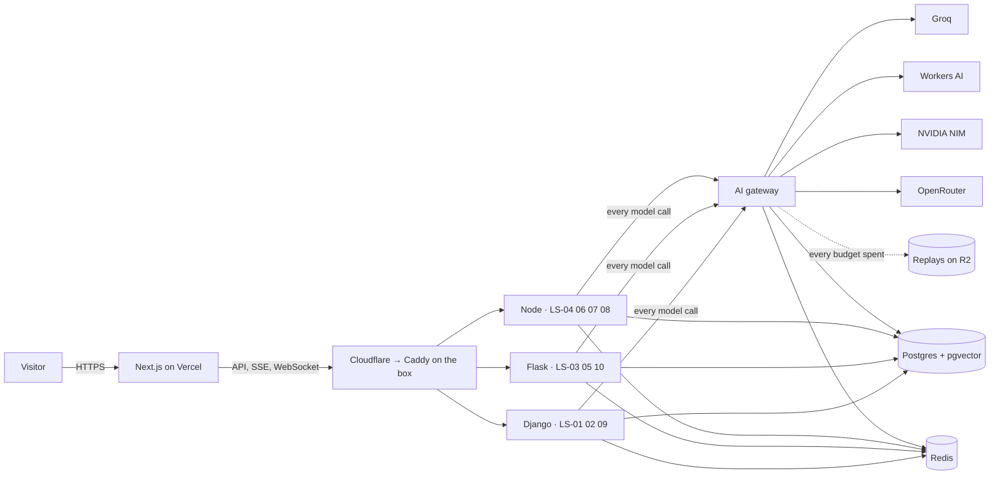

# Stack decision

Status: accepted · Rev B · 27 Sep 2026 · Owner: Landry

This is the stack for the portfolio and the reasons behind each choice. The build
process is in [`PLAYBOOK.md`](PLAYBOOK.md). Session rules for Claude are in
[`../CLAUDE.md`](../CLAUDE.md).

## Constraints that shaped it

1. **Free AI tiers only**: Groq, Cloudflare Workers AI, NVIDIA NIM and OpenRouter.
   Each has its own rate limits, model list and terms, and all of them change without
   notice.
2. **Public visitors.** Anyone can run a demo, so there can be no cold starts, no
   broken demos, and no way for one visitor or bot to drain the shared quota.
3. **Near-zero budget.** Pay only for what free tiers do badly: always-on compute.
4. **Show range.** Django, Flask (sync and async), Node + TypeScript and React + TSX,
   each used where it is the natural fit.
5. **One developer.** Every moving part has to earn its place.

## Summary

| Layer | Choice | Why |
|---|---|---|
| Front end | Next.js (App Router) · React 19 · TypeScript strict (TSX) | Server components for fast datasheet pages, client islands for live demos, best-in-class hosting on Vercel |
| Styling | Tailwind CSS v4 with CSS-variable tokens | Tokens are the single source of the datasheet palette and type; utilities keep components consistent |
| Components | React Aria Components, wrapped in `packages/ui` | Best-in-class accessibility with no visual opinions, so the site never looks like a template |
| Motion and data viz | Motion · visx · Vega-Lite (LS-05) · React Flow (LS-08) · react-pdf (LS-04) | Full control for the Scope timeline; Vega-Lite specs are data, so model-written charts can't run code |
| AI gateway | TypeScript · Fastify 5 · OpenAI-compatible API | One door for every model call: routing, fallback, quotas, cache, spans. Streaming proxies are I/O-bound, which suits Node |
| Django systems | Python 3.13 · Django 5.2 LTS · Django Ninja · Channels 4 · Celery 5 | LS-01, LS-02, LS-09. Rich relational domains, admin, WebSockets and background jobs |
| Flask systems | Flask 3.1 · flask-openapi3 · SQLAlchemy 2 · gunicorn (gthread) | LS-03, LS-05, LS-10. Sync where work is CPU-bound, async views where one request fans out |
| Node systems | Node 24 LTS · Fastify 5 · Drizzle ORM · BullMQ · Playwright | LS-04, LS-06, LS-07, LS-08. Event streams, workflows, browser automation, shared Zod types |
| Model clients | AI SDK (TypeScript) · `openai` SDK + instructor (Python) | Both point at the gateway; typed structured output with validation and repair |
| Database | PostgreSQL 17 + pgvector, one schema per system | One stateful store for relational data, vectors and job state; synthetic data rebuilt from seed |
| Cache and queues | Redis 8 on the box | Celery, Channels and BullMQ poll constantly, which would exhaust a command-metered free tier |
| Files | Cloudflare R2 with lifecycle rules | Visitor uploads expire by storage policy, not by a cron job; replay recordings live here too |
| Analytics data | DuckDB over Parquet (LS-05) | Millions of synthetic orders queried in-process, read-only, with no database load |
| Hosting | Vercel Hobby (front end) · one ARM64 box with Docker Compose behind Caddy and Cloudflare | Always on, no cold starts, identical in development and production |
| Edge | Cloudflare DNS, proxy, WAF, Turnstile | Hides the origin, stops bots before they spend quota |
| Observability | Run spans in Postgres (Scope and measured datasheet numbers) · Sentry · uptime monitor | Product telemetry and ops telemetry kept separate |
| Tooling | pnpm + Turborepo · uv · mise · just · Biome · Ruff · mypy · lefthook | Fast, polyglot, one command surface |
| CI/CD | GitHub Actions → GHCR → SSH deploy · Vercel previews | Free on a public repo; every PR gets a preview and the full gate |

## Architecture



The ten systems run as three modular monoliths, one per runtime, plus the gateway.
Each system is a module with its own API prefix, schema and tests, so any of them can
be split into its own service later. Ten separate services would cost more to host
and operate than they are worth for one developer.

## Front end

- **Next.js App Router, React 19, TypeScript strict.** Datasheet pages render on the
  server from MDX (Content Collections gives typed frontmatter for part numbers and
  specs). Live demos are client islands.
- **Backend-for-frontend.** The Next.js server issues the visitor session (signed,
  anonymous cookie), verifies Turnstile, and mints short-lived JWTs (`jose`) for
  direct SSE and WebSocket connections to the box. Vercel functions don't hold
  WebSockets, so live streams go straight to the API domain.
- **Streaming.** One SSE stream per run multiplexes tokens, spans and the final
  result, which is what the Scope panel draws. LS-02 and LS-06 use WebSockets.
- **Data.** TanStack Query for server state; `openapi-fetch` clients generated from
  each service's OpenAPI spec; Zod at every boundary.
- **Design system.** Tailwind v4 tokens, React Aria Components, Archivo and Martian
  Mono through `next/font` (no layout shift), `cmdk` for the command palette,
  `next-intl` when a second language lands. Storybook is the living component
  catalog.
- **Quality bars.** WCAG 2.2 AA (axe in CI), LCP under 2 s, INP under 200 ms,
  CLS under 0.05 (Lighthouse CI budgets). Playwright covers journeys and visual
  regressions; Vitest and Testing Library cover components.

## Back ends

### Django systems (LS-01 Support Desk, LS-02 Booking Concierge, LS-09 Meeting Recorder)

- **Django 5.2 LTS**, supported until April 2028, over the newest feature release.
- **Django Ninja** for APIs: Pydantic schemas (the same style as the Flask side),
  native async views, and OpenAPI with little code. DRF is the common alternative;
  Ninja is lighter and typed.
- **Channels 4** served by uvicorn for WebSockets (LS-02 live calendar), with a
  Redis channel layer.
- **Celery 5** with Redis for jobs and Celery beat for schedules (nightly calendar
  reset, retention sweeps).
- **Postgres specifics.** LS-02 prevents double booking with an exclusion constraint
  on time ranges. LS-01 stores embeddings in pgvector and combines them with Postgres
  full-text search for hybrid retrieval.
- **Speech (LS-09).** Groq Whisper in fast mode, faster-whisper on the box in private
  mode.

### Flask systems (LS-03 Invoice Reader, LS-05 Data Analyst, LS-10 Eval Lab)

- **Flask 3.1** with **flask-openapi3** (Pydantic models become OpenAPI 3.1) and
  **SQLAlchemy 2** with Alembic migrations.
- **Served by gunicorn with threaded workers.** LS-05 is synchronous on purpose: its
  queries are short and CPU-bound, threads cover the model wait, and the code stays
  simple.
- **Async views where one request fans out.** LS-03 runs OCR and extraction
  concurrently; LS-10 fans out evaluation calls with `asyncio.gather` under a
  semaphore. Flask async views give concurrency inside a request, not more
  concurrent requests. If a Flask system ever needs many long-lived connections, it
  moves to Quart, the ASGI version of Flask.
- **LS-03:** RapidOCR (ONNX, runs on CPU) for word boxes, a vision model through the
  gateway for fields, instructor + Pydantic for typed extraction with validation
  retries, and deterministic arithmetic checks.
- **LS-05:** DuckDB over Parquet, sqlglot to parse and allowlist every query, a
  read-only connection, a forced row limit and a timeout.

### Node systems (LS-04 Contract Radar, LS-06 Incident Commander, LS-07 QA Engineer, LS-08 Automation Studio)

- **Node 24 LTS, Fastify 5** with the Zod type provider (one schema for validation,
  types and OpenAPI), `@fastify/websocket`, and pino logging.
- **Drizzle ORM** for Postgres: SQL-first, no binary engine, one schema per system.
- **BullMQ** for jobs: contract parsing (LS-04), browser runs (LS-07), durable
  workflow steps (LS-08). LS-06 streams simulator events through Redis Streams.
- **AI SDK** for tool loops, streaming and `generateObject` with Zod, pointed at the
  gateway through its OpenAI-compatible provider.
- **LS-04:** `pdfjs-dist` on the server and `react-pdf` in the browser use the same
  text layer, so quote positions line up exactly.
- **LS-07:** Playwright and axe-core in a separate worker container with concurrency
  1, on a Docker network that can only reach the staging shop.

## Data

- **PostgreSQL 17 + pgvector** in a container on the box, one database, one schema
  per system, plus a `platform` schema for sessions, quotas, usage and run spans.
  Each runtime owns its migrations: Django migrations, Alembic, Drizzle.
- **Synthetic by design.** A deterministic seed package (Faker with fixed seeds)
  builds Basalt & Bean's customers, orders, policies, contracts and meetings.
  `just seed` rebuilds everything, so data loss is a non-event. Nightly `pg_dump` to
  R2 still runs for visitor golden-set contributions.
- **Redis 8** for Celery, Channels, BullMQ, gateway budgets, circuit breakers and the
  response cache.
- **Cloudflare R2** for uploads (lifecycle rules delete them after 1 to 24 hours,
  depending on the system) and for replay recordings.
- **DuckDB + Parquet** for LS-05's two million synthetic orders.

## Infrastructure and hosting

- **Front end:** Vercel Hobby. The portfolio is personal and non-commercial, which
  the Hobby plan allows. Every pull request gets a preview.
- **The box:** one ARM64 VM running Docker Compose: Caddy, the gateway, the three
  system apps, their workers, the staging shop, Postgres and Redis.
  - Recommended: Hetzner CAX21 (4 vCPU, 8 GB RAM, about €7 a month). Predictable
    and never reclaimed.
  - Zero-cost option: Oracle Cloud Always Free (Ampere A1, 4 OCPU, 24 GB RAM). Upgrade
    the account to pay-as-you-go (still $0) so idle instances are not reclaimed.
- **Edge:** Cloudflare proxies the API domain (the box only accepts Cloudflare IPs),
  adds WAF rules and DDoS protection, and serves Turnstile.
- **Deploys:** GitHub Actions builds multi-arch images, pushes them to GHCR, and
  deploys over SSH with `docker compose pull && docker compose up -d` and health
  checks. Rollback means redeploying the previous image tag.

## Observability

- **Run spans** are the product telemetry. A small shared tracer (Python and
  TypeScript) records every step of a visitor's run: gateway attempts, retrieval,
  tools, guards. Spans stream live to the Scope through Redis Streams and SSE, and
  land in `platform.run_spans` for permalinks. Datasheet numbers (p50 and p95
  latency, calls per run, pass rates) are SQL over this table.
- **Sentry** (free plan) for errors and releases across Next.js, Python and Node.
- **Uptime monitor with a public status page** (Better Stack or UptimeRobot free
  tier), plus scripted Playwright journeys every 30 minutes from GitHub Actions.

## Security

- **Secrets:** provider keys exist only in the gateway container. Services
  authenticate to the gateway with per-service tokens. Keys come from GitHub
  environment secrets at deploy time and are never committed.
- **Visitors:** anonymous sessions, Turnstile before the first run, short-lived JWTs,
  per-visitor quotas in the gateway, rate limits at Cloudflare and Caddy.
- **Untrusted content:** tickets, uploads and web pages stay out of instruction
  slots. Tools with side effects need human approval. Free-text input passes a
  moderation model first.
- **Sandboxes:** read-only SQL with a parse-tree allowlist (LS-05), a browser that can
  only reach the staging shop (LS-07), mock connectors for every side effect (LS-08).
- **Supply chain:** Renovate, CodeQL, gitleaks (pre-commit and CI), Trivy image scans,
  GitHub Actions pinned by commit SHA.
- **Data:** synthetic only. Upload screens warn visitors not to send personal data,
  because some free AI endpoints log prompts.

## Tooling and CI

- **Monorepo:** pnpm workspaces with Turborepo for TypeScript, a uv workspace for
  Python, mise to pin tool versions, and a root `justfile` as the one command
  surface (`just dev`, `just test`, `just lint`, `just seed`).
- **Quality:** Biome (TypeScript lint and format), Ruff (Python lint and format),
  `tsc --strict`, mypy with django-stubs, lefthook for pre-commit hooks.
- **Tests:** Vitest, pytest (with pytest-django, pytest-asyncio and Hypothesis for
  invoice arithmetic), Testcontainers for real Postgres and Redis, Playwright for end
  to end.
- **CI gates on every PR:** lint, types, tests for changed packages, OpenAPI client
  drift check, eval gate when prompts or routes change, axe and Lighthouse budgets.
  Making the repository public keeps Actions minutes free.

## Repository layout

```text
apps/web/                 Next.js site and every demo UI (TSX)
services/gateway/         AI gateway (TypeScript, Fastify) + routing.yaml
services/node-systems/    LS-04, LS-06, LS-07, LS-08 (+ worker entry point)
services/django-systems/  LS-01, LS-02, LS-09 (+ Celery worker)
services/flask-systems/   LS-03, LS-05, LS-10
services/staging-shop/    Deliberately buggy shop for LS-07 (Vite + React)
packages/ui/              Design system: tokens, React Aria components, Storybook
packages/contracts/       Shared Zod schemas and event types
packages/api-clients/     TypeScript clients generated from OpenAPI
python/ls-common/         Shared Python: gateway client, tracer, run context
data/seed/                Deterministic synthetic data for Basalt & Bean
infra/                    docker-compose.yml, Caddyfile, deploy scripts
docs/                     STACK.md, PLAYBOOK.md, decision records
```

## Costs

| Item | Cost |
|---|---|
| AI providers (free tiers) | $0 |
| Vercel Hobby | $0 |
| Cloudflare DNS, WAF, Turnstile, R2 (up to 10 GB) | $0 |
| The box: Hetzner CAX21, or Oracle Always Free | about €7/month, or $0 |
| Domain | about $10–15/year |
| Sentry, uptime monitor, GitHub Actions (public repo) | $0 |

## Alternatives considered

| Option | Decision | Reason |
|---|---|---|
| One microservice per system | Rejected | Ten deployables on free or cheap hosting, operated by one person, cost more than they show |
| Serverless back ends (Vercel functions, Cloud Run) | Rejected | Cold starts, WebSockets, Playwright, Whisper and long agent runs don't fit |
| Managed Postgres (Supabase, Neon) | Not now | All data is synthetic and reproducible; a co-located Postgres avoids free-tier size caps and pauses. Revisit for managed backups or branching |
| Upstash Redis | Rejected | Celery, Channels and BullMQ poll constantly and would exhaust a command-metered free tier |
| LangChain or LlamaIndex | Rejected | Thin, explicit pipelines are easier to trace, test and explain. The Scope is meant to show every call, not hide it |
| Gateway as a Cloudflare Worker | Rejected | Workers Free caps CPU time per request and adds a second deploy platform |
| DRF instead of Django Ninja | Rejected | Ninja gives Pydantic schemas, async views and OpenAPI with less code |
| Prisma instead of Drizzle | Rejected | Drizzle is SQL-first with no engine binary |
| shadcn/ui instead of React Aria | Rejected | shadcn's default look is the generic AI-site look this design avoids |
| ESLint + Prettier instead of Biome | Rejected | One fast tool covers both, and Next.js supports it |

## Revisit when

- A free tier shrinks or disappears: update `routing.yaml` and revalidate in Eval Lab.
- Traffic outgrows the free budgets: move the busiest route to a paid tier first.
- The site becomes commercial: move to Vercel Pro and review every provider's terms.
