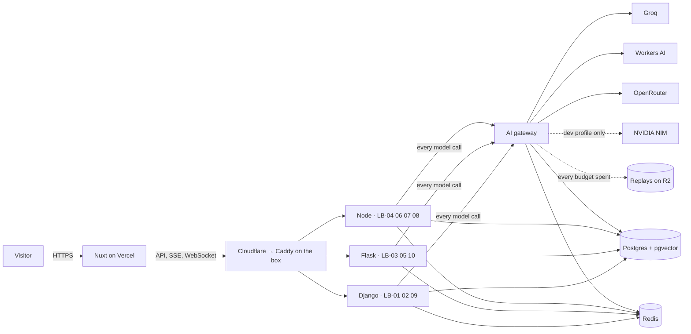

# Stack decision

Status: accepted · Rev J · 29 Sep 2026 · Owner: Landry

This is the stack for the portfolio and the reasons behind each choice. The build
process is in [`PLAYBOOK.md`](PLAYBOOK.md). Session rules for coding agents are in
[`../AGENTS.md`](../AGENTS.md).

## Constraints that shaped it

1. **Free AI tiers only**: Groq, Cloudflare Workers AI, NVIDIA NIM and OpenRouter.
   Each has its own rate limits, model list and terms, and all of them change without
   notice. NVIDIA's terms rule it out for visitor traffic (see below).
2. **Public visitors.** Anyone can run a demo, so there can be no cold starts, no
   broken demos, and no way for one visitor or bot to drain the shared quota.
3. **Near-zero budget.** Free tiers everywhere, including the always-on server. The
   only fixed cost is the domain.
4. **Show range.** Django, Flask (sync and async), Node + TypeScript and Nuxt (Vue 3)
   with Pinia, each used where it is the natural fit.
5. **One developer.** Every moving part has to earn its place.

## Summary

| Layer | Choice | Why |
|---|---|---|
| Front end | Nuxt 4 · Vue 3.5 · Pinia · TypeScript strict in single-file components (no TSX) | The owner's choice. Hybrid rendering (prerendered datasheets, server-rendered demos), Nitro server routes for the no-accounts backend, Pinia stores for live runs |
| Styling | CSS-variable tokens in `packages/ui`, light and dark, and scoped styles in each single-file component | Tokens are the single source of the palette and type; the datasheet look is bespoke, so scoped CSS beats a utility framework |
| Components | Reka UI, wrapped in `packages/ui` | Accessible headless primitives for Vue with no visual opinions, so the site never looks like a template |
| Icons | `@lb/icons`, drawn in the logo's pattern | One SVG sprite and a Vue `<LbIcon>` component; no emoji, no third-party icon sets |
| Motion and data viz | Motion for Vue · Unovis · Vega-Lite (LB-05) · Vue Flow (LB-08) · pdf.js (LB-04) | Full control for the Scope timeline; Vega-Lite specs are data, so model-written charts can't run code |
| AI gateway | TypeScript · Fastify 5 · OpenAI-compatible API | One door for every model call: routing, fallback, token-aware budgets, data-class rules, cache, spans. Streaming proxies are I/O-bound, which suits Node |
| Django systems | Python 3.13 · Django 5.2 LTS · Django Ninja · Channels 4 · Celery 5 | LB-01, LB-02, LB-09. Rich relational domains, admin, WebSockets and background jobs |
| Flask systems | Flask 3.1 · flask-openapi3 · SQLAlchemy 2 · gunicorn (gthread) | LB-03, LB-05, LB-10. Sync where work is CPU-bound, async views where one request fans out |
| Node systems | Node 24 LTS · Fastify 5 · Drizzle ORM · BullMQ · Playwright | LB-04, LB-06, LB-07, LB-08. Event streams, workflows, browser automation, shared Zod types |
| Model clients | AI SDK (TypeScript) · `openai` SDK (Python), with a small JSON-and-repair helper in the Django systems | Both point at the gateway; typed structured output with validation and one repair |
| Database | PostgreSQL 17 + pgvector, one schema per system | One stateful store for relational data, vectors and job state; synthetic data rebuilt from seed |
| Cache and queues | Redis 8 on the box | Celery, Channels and BullMQ poll constantly, which would exhaust a command-metered free tier |
| Files | Cloudflare R2 with lifecycle rules | Visitor uploads expire by storage policy, not by a cron job; replay recordings live here too |
| Analytics data | DuckDB over Parquet (LB-05) | Millions of synthetic orders queried in-process, read-only, with no database load |
| Hosting | Vercel Hobby (front end) · one Oracle Cloud Always Free ARM64 VM (2 OCPUs, 12 GB) with Docker Compose, reachable only through a Cloudflare Tunnel | Always on at $0, no cold starts, zero inbound ports, identical in development and production |
| Edge | Cloudflare DNS, WAF, Turnstile, Tunnel | Hides the origin and stops bots before they spend quota |
| Security | No accounts · zero inbound ports · least privilege · signed images | Every layer is in [`SECURITY.md`](SECURITY.md) |
| Observability | Run spans in Postgres (Scope and measured datasheet numbers) · Sentry · uptime monitor | Product telemetry and ops telemetry kept separate |
| Tooling | pnpm + Turborepo · uv · mise · just · ESLint · vue-tsc · Ruff · mypy · lefthook | Fast, polyglot, one command surface |
| CI/CD | GitHub Actions → GHCR → SSH deploy · Vercel previews | Free on a public repo; every PR gets a preview and the full gate |

## Architecture



The ten systems run as three modular monoliths, one per runtime, plus the gateway.
Each system is a module with its own API prefix, schema and tests, so any of them can
be split into its own service later. Ten separate services would cost more to host
and operate than they are worth for one developer.

## AI providers and routing

Free tiers were checked against each provider's official documentation on
27 Sep 2026 (sources at the end of this section). They change often: the Llama models
left Groq's free tier in August 2026. The playbook schedules a weekly re-check.

| Provider | Free limit | Trains on inputs | Role here |
|---|---|---|---|
| Groq | Per model: 30 req/min, 1,000 req/day, 8K tokens/min, 200K tokens/day. Whisper: 480 audio minutes/day. Prompt Guard 2: 14,400 req/day | No (abuse logs kept up to 30 days) | Primary for interactive chat and tool calls (`openai/gpt-oss-120b`, `openai/gpt-oss-20b`, `qwen/qwen3.8-27b`), speech-to-text, prompt-injection checks |
| Cloudflare Workers AI | 10,000 Neurons/day shared by all models: about 150 gpt-oss-120b calls, or about 9M embedding tokens. 300 req/min for text | No | Embeddings (`bge-m3`), reranking (`bge-reranker-base`), vision (Llama 4 Scout, Gemma 4), Whisper and chat fallback. The default home for visitor uploads |
| OpenRouter | 20 req/min, 1,000 req/day: the one-time $10 credit is bought (D9), and the tier follows credits ever purchased, not the balance | Depends on the host; several free hosts may train | Last fallback, and long-context work on synthetic samples (Nemotron 3 Ultra, 1M tokens) |
| NVIDIA API catalog | Per-model rate limits, unpublished (about 40 req/min reported) | Yes: inputs and outputs are recorded | Private model scouting and offline experiments only. Its trial terms forbid production use, so it never serves visitors |

Left out on purpose: Gemini's free tier (it can't be offered to users in the EEA,
Switzerland or the UK, and it trains on inputs), Cerebras (no permanent free tier) and
Mistral's free mode (trains on inputs unless you opt out).

### Routing rules

1. **Virtual models.** Services ask for a capability alias, never a provider model.
   Chains live in `services/gateway/routing.yaml`.
2. **Data class.** Every request is tagged `synthetic` or `visitor`. Visitor content
   only reaches providers that don't train on inputs (Groq, Workers AI). Synthetic
   samples may use any provider on the chain.
3. **Terms profile.** Production routing excludes providers whose terms forbid it
   (NVIDIA today). A `dev` profile allows them for local experiments.
4. **Token-aware budgets.** The gateway estimates tokens before sending and tracks
   requests and tokens, per minute and per day, for every provider model, and Neurons
   for Workers AI's shared daily pool. Minute windows slide; day windows reset at
   00:00 UTC, as the providers' do. The provider's own token count corrects each
   estimate after the call. On Groq the binding limit is tokens: 200K a day is about
   65 calls of 3K tokens. Interactive prompts stay under 4K tokens to fit the 8K
   tokens-per-minute limit, and CI checks every alias against it. Budgets live in
   Redis; if Redis is down, the gateway refuses calls rather than spend unmetered.
5. **Fallback before the first token.** A 429, timeout or 5xx moves the request to the
   next model on its chain. Once an answer is streaming, it never switches provider.
6. **Structured output.** Groq's strict JSON schema works only without streaming and
   without tools. Tool loops validate arguments with Zod or Pydantic instead.
7. **Embeddings are pinned.** Vectors from different models don't mix, so `lb-embed`
   has no fallback. If Workers AI is down, retrieval degrades to Postgres full-text
   search.
8. **Guard free text.** Every visitor-typed input passes Prompt Guard 2 before it
   reaches a model that can call tools. The classifier reads 512 tokens at a time, so
   the gateway reads a long text in overlapping segments, and flags it when any
   segment scores at or above the threshold. The guard fails closed: without a
   readable verdict, the text counts as unchecked.

### Virtual models

| Alias | Used by | Chain, in order |
|---|---|---|
| `lb-fast` | Classification, short JSON (LB-01, LB-05, LB-09) | Groq gpt-oss-20b → Workers AI gpt-oss-20b → Workers AI glm-4.7-flash |
| `lb-tools` | Chat and tool calls (LB-01, LB-02, LB-06, LB-07, LB-08) | Groq gpt-oss-120b → Groq qwen3.8-27b → Workers AI gpt-oss-120b → OpenRouter qwen3.8-27b:free (synthetic only) |
| `lb-reason` | SQL and planning (LB-05, LB-06) | Groq gpt-oss-120b → Workers AI gpt-oss-120b → OpenRouter nemotron-3-super:free (synthetic only) |
| `lb-long` | Long documents (LB-04) | Workers AI gpt-oss-120b for uploads. OpenRouter nemotron-3-ultra:free for synthetic samples |
| `lb-vision` | Invoices, screenshots (LB-03, LB-07) | Workers AI Llama 4 Scout → Workers AI Gemma 4 26B → OpenRouter Gemma 4 31B:free (synthetic only) |
| `lb-embed` | Retrieval (LB-01, LB-02) | Workers AI bge-m3, pinned |
| `lb-rerank` | Retrieval (LB-01) | Workers AI bge-reranker-base, the only reranker on the free tiers. It reads English and Chinese, so queries are reranked in English |
| `lb-stt` | Fast mode (LB-09) | Groq whisper-large-v3-turbo → Workers AI whisper-large-v3-turbo. Private mode runs faster-whisper on the box |
| `lb-guard` | Every free-text input | Groq llama-prompt-guard-2-86m → Groq llama-prompt-guard-2-22m. Both are Groq previews, and nothing else checks for injection, so the guard fails closed |
| `lb-judge` | Nightly evals (LB-10) | Groq gpt-oss-120b → Workers AI gpt-oss-120b |

These model IDs are the candidates on 27 Sep 2026. Each must pass its route's golden
set in Eval Lab before it serves visitors. The exact provider model IDs, context sizes,
capabilities and limits live in `services/gateway/routing.yaml`, which CI validates.
`lb-rerank` and `lb-guard` joined the gateway for LB-01, each with an endpoint of its
own (`/v1/rerank` for scores from 0 to 1, `/v1/guard` for a normalised verdict);
`lb-stt` joins with LB-09. Llama Guard 3 is no fallback for the guard: it scores
content safety (hazard categories S1 to S14), not injection, and Workers AI offers no
injection classifier.

### Capacity

| Source | Estimated daily capacity |
|---|---|
| Groq chat: three models × 200K tokens | about 240 calls at 2.5K tokens each |
| Workers AI, after embeddings, reranking and vision | about 90 chat calls |
| OpenRouter, synthetic content only | 1,000 calls |
| **Total** | **about 1,330 calls a day: about 330 for visitors' own input, 1,000 more for samples, replays and evals** |

Most systems need 1 to 4 calls per run, so Groq and Workers AI carry roughly 100
visitor runs a day before replay mode takes over. That is enough for a portfolio. The
three heavy systems are designed to be frugal:

- **LB-06** keeps detection and correlation in deterministic code, and its agents
  reason over compact summaries: 10 to 15 calls per incident.
- **LB-07** plans the test once, runs it with Playwright, and asks the model again
  only when a step fails: 5 to 8 calls per run.
- **LB-10** visitor runs use 10 cases and rule-based graders, about 20 calls. The LLM
  judge runs nightly.

**Decision D9, taken:** the one-time $10 OpenRouter credit is bought. It lifts
OpenRouter from 50 to 1,000 free requests a day for good. OpenRouter never sees
visitor content, so that capacity goes to curated samples, replay recordings and
evals, which leaves Groq and Workers AI to visitors' own input. The balance must stay
above zero: OpenRouter refuses even free models on a negative balance.

Sources, checked 27 Sep 2026:
Groq [rate limits](https://console.groq.com/docs/rate-limits),
[models](https://console.groq.com/docs/models),
[deprecations](https://console.groq.com/docs/deprecations),
[structured outputs](https://console.groq.com/docs/structured-outputs),
[data](https://console.groq.com/docs/your-data) ·
OpenRouter [limits](https://openrouter.ai/docs/api_reference/limits),
[FAQ](https://openrouter.ai/docs/faq),
[provider logging](https://openrouter.ai/docs/guides/privacy/provider-logging) ·
Cloudflare [Workers AI pricing](https://developers.cloudflare.com/workers-ai/platform/pricing/),
[limits](https://developers.cloudflare.com/workers-ai/platform/limits/),
[data usage](https://developers.cloudflare.com/workers-ai/platform/data-usage/) ·
NVIDIA [API trial terms](https://assets.ngc.nvidia.com/products/api-catalog/legal/NVIDIA%20API%20Trial%20Terms%20of%20Service.pdf) ·
Google [Gemini API terms](https://ai.google.dev/gemini-api/terms)

## Front end

- **Nuxt 4, Vue 3.5, TypeScript strict.** The owner chose Nuxt with Pinia over
  Next.js. Components are single-file components with `<script setup lang="ts">`;
  there is no TSX or JSX in the repo. Pages render on the server for every request,
  so each response carries a fresh CSP nonce. The ten datasheets are typed data
  (`apps/web/shared/data/systems.ts`) checked against a Zod schema in the unit tests.
  Heavy demo panels will hydrate only when they scroll into view.
- **Backend-for-frontend.** There are no accounts: no sign-up, login or logout. Nitro
  server routes issue an anonymous visitor session (signed cookie), verify Turnstile,
  and mint short-lived JWTs (`jose`) for direct SSE and WebSocket connections to the
  box. Vercel functions don't hold WebSockets, so live streams go straight to the API
  domain.
- **State.** Pinia setup stores hold client state: the live run and its spans, the
  visitor's remaining quota, the reading mode (Brief or Technical) and demo inputs.
  Page data loads with `useFetch` and `useAsyncData`, so it renders on the server and
  hydrates without a second request. Pinia Colada caches the server data a demo
  refetches, such as quota and run history.
- **Streaming.** One SSE stream per run multiplexes tokens, spans and the final
  result; a Pinia store consumes it, and the Scope panel draws from the store. LB-02
  and LB-06 use WebSockets.
- **Data.** `openapi-fetch` clients generated from each service's OpenAPI spec; Zod
  at every boundary.
- **Design system.** `packages/ui` is a Nuxt layer: the colour tokens with light and
  dark values, the base components, and theme switching. Reka UI primitives join it as
  demos need them, and icons come from `@lb/icons`. Archivo and Martian Mono are
  self-hosted variable fonts (Fontsource) with the width axis the expanded headings
  use (both include the Latin Extended letters Czech needs). A command palette built
  on Reka UI's combobox. Storybook is the living component catalog.
- **Languages (decision D6).** English by default at `/`, Czech at `/cs`, with
  `@nuxtjs/i18n`. Interface text lives in typed locale files, where the Czech file must
  match the English shape, so a missing translation fails the type check. Datasheets
  keep English as the source and overlay the Czech text, checked field by field in the
  unit tests. There is no redirect by browser language, because it would need a
  cookie; the language switch is a pair of plain links. Every page sets `<html lang>`
  and hreflang links, and Czech text is typeset so no line ends on a single-letter
  word.
- **Themes.** Light by default, dark when the visitor's system prefers it, with a
  toggle. `@nuxtjs/color-mode` applies the theme before first paint (its inline
  script gets the per-request CSP nonce), and keeps the visitor's choice in
  `localStorage`, not a cookie. The logo swaps between `lb-mark-light.svg` and
  `lb-mark-dark.svg`.
- **Quality bars.** WCAG 2.2 AA in both themes and both languages (axe in CI), LCP
  under 2 s, INP under 200 ms, CLS under 0.05 (Lighthouse CI budgets). Playwright
  covers journeys and visual regressions in both themes; Vitest with Vue Test Utils
  and `@nuxt/test-utils` covers components and stores.

## Back ends

### Django systems (LB-01 Support Desk, LB-02 Booking Concierge, LB-09 Meeting Recorder)

- **Django 5.2 LTS**, supported until April 2028, over the newest feature release.
- **Django Ninja** for APIs: Pydantic schemas (the same style as the Flask side),
  native async views, and OpenAPI with little code. DRF is the common alternative;
  Ninja is lighter and typed.
- **Channels 4** served by uvicorn for WebSockets (LB-02's conversation and live
  calendar), with a Redis channel layer. The visitor token travels in the first frame,
  never in the address, so proxy logs never hold it.
- **Celery 5** with Redis for jobs and Celery beat for schedules (nightly calendar
  reset, retention sweeps).
- **Postgres specifics.** LB-02 prevents double booking with an exclusion constraint
  on a room and its time range (`btree_gist`, installed in the shared `extensions`
  schema). A hold expires by being read against the clock, so no sweep is needed for
  correctness. LB-01 stores embeddings in pgvector and combines them with Postgres
  full-text search for hybrid retrieval.
- **Speech (LB-09).** Groq Whisper in fast mode, faster-whisper on the box in private
  mode.

### Flask systems (LB-03 Invoice Reader, LB-05 Data Analyst, LB-10 Eval Lab)

- **Flask 3.1** with **flask-openapi3** (Pydantic models become OpenAPI 3.1) and
  **SQLAlchemy 2** with Alembic migrations.
- **Served by gunicorn with threaded workers.** LB-05 is synchronous on purpose: its
  queries are short and CPU-bound, threads cover the model wait, and the code stays
  simple.
- **Async views where one request fans out.** LB-03 runs OCR and extraction
  concurrently; LB-10 fans out evaluation calls with `asyncio.gather` under a
  semaphore. Flask async views give concurrency inside a request, not more
  concurrent requests. If a Flask system ever needs many long-lived connections, it
  moves to Quart, the ASGI version of Flask.
- **LB-03:** RapidOCR (ONNX, runs on CPU) for word boxes, a vision model through the
  gateway for fields, instructor + Pydantic for typed extraction with validation
  retries, and deterministic arithmetic checks.
- **LB-05:** DuckDB over Parquet, sqlglot to parse and allowlist every query, a
  read-only connection, a forced row limit and a timeout. The service stacks six
  layers (parse, allowlist, plan check, a locked-down read-only connection, row cap,
  timeout) and runs only the tree it rebuilt from the allowlist, never the model's
  text; its README has the threat model.

### Node systems (LB-04 Contract Radar, LB-06 Incident Commander, LB-07 QA Engineer, LB-08 Automation Studio)

- **Node 24 LTS, Fastify 5** with the Zod type provider (one schema for validation,
  types and OpenAPI), `@fastify/websocket`, and pino logging.
- **Drizzle ORM** for Postgres: SQL-first, no binary engine, one schema per system.
- **BullMQ** for jobs: contract parsing (LB-04), browser runs (LB-07), durable
  workflow steps (LB-08). LB-06 streams simulator events through Redis Streams.
- **AI SDK** for tool loops, streaming and `generateObject` with Zod, pointed at the
  gateway through its OpenAI-compatible provider.
- **LB-08's engine** is one BullMQ job per workflow step (three attempts, exponential
  backoff, a dead-letter queue), a Postgres run log, and an outbox with idempotency keys
  so a side effect happens once even when a worker dies after sending it. Free steps run
  inside the transaction; the site follows a run by polling its log with a cursor. See
  [`services/node-systems/README.md`](../services/node-systems/README.md).
- **LB-04:** pdf.js (`pdfjs-dist`) on the server and in the browser uses the same
  text layer, so quote positions line up exactly.
- **LB-07:** Playwright and axe-core in a separate worker container with concurrency
  1, on a Docker network that can only reach the staging shop.

## Data

- **PostgreSQL 17 + pgvector** in a container on the box, one database, one schema
  per system, plus a `platform` schema for sessions, quotas, usage and run spans.
  Each runtime owns its migrations: Django migrations, Alembic, Drizzle.
- **Synthetic by design.** A deterministic seed package (Faker with fixed seeds)
  builds Basalt & Bean's customers, orders, policies, contracts and meetings.
  `just seed` rebuilds everything, so data loss is a non-event. Nightly `pg_dump` to
  R2 still runs for visitor golden-set contributions.
- **Redis 8** for Celery, Channels, BullMQ, gateway budgets, circuit breakers and the
  response cache.
- **Cloudflare R2** for uploads (lifecycle rules delete them after 1 to 24 hours,
  depending on the system) and for replay recordings.
- **DuckDB + Parquet** for LB-05's two million synthetic orders.

## Infrastructure and hosting

- **Front end:** Vercel Hobby. The portfolio is personal and non-commercial, which
  the Hobby plan allows. Every pull request gets a preview.
- **The box:** one Oracle Cloud Always Free VM (the owner's choice): Ampere A1, ARM64,
  2 OCPUs and 12 GB of RAM, running Ubuntu LTS and Docker Compose. It hosts
  `cloudflared`, Caddy, the gateway, the three system apps, their workers, the staging
  shop, Postgres and Redis, for $0.
  - **Limits.** Oracle halved the Always Free Arm allowance on 15 June 2026, to
    1,500 OCPU hours and 9,000 GB hours a month: one VM with 2 OCPUs and 12 GB,
    running all month. Also free: 200 GB of block storage (boot volume included),
    20 GB of object storage and 10 TB of outbound data a month. The VM is sized exactly
    at the limit.
  - **Two cores.** CPU-heavy jobs (LB-07 browser runs, LB-09 private transcription,
    LB-03 OCR) run one at a time from their queues, and replay mode covers bursts.
    12 GB of RAM holds every service with headroom, and each container has a memory
    limit.
  - **Staying free.** Oracle reclaims an Always Free VM only when CPU, network and
    memory all stay under 20% for 7 days. With every service resident, memory stays
    well above 20%, and the launch checklist confirms it in the OCI metrics. The
    tenancy stays on Always Free: pay-as-you-go adds billing risk, and Oracle documents
    the same free allowance for every tenancy.
  - **Home region.** Always Free compute must run in the tenancy's home region, which
    can't be changed later. An "out of host capacity" error means a temporary
    shortage there; retry.
  - **No SLA.** The box can be rebuilt anywhere from the signed images, the seed and
    the encrypted backups on R2. Fallback: Hetzner CAX21 (4 vCPU, 8 GB, about €7 a
    month) runs the same images unchanged.
  - Sources, checked 28 Sep 2026: Oracle
    [Always Free resources](https://docs.oracle.com/en-us/iaas/Content/FreeTier/freetier_topic-Always_Free_Resources.htm),
    InfoQ on [the June 2026 cut](https://www.infoq.com/news/2026/07/oracle-cloud-free-tier-limits/).
- **Edge:** the box runs `cloudflared` and opens no inbound ports. Cloudflare adds WAF
  rules, DDoS protection and Turnstile. SSH and owner tools are reachable only over
  Tailscale.
- **Deploys:** GitHub Actions builds multi-arch images, signs them, pushes them to
  GHCR, joins the Tailscale network with an ephemeral key, and deploys over SSH. The
  box verifies each image's signature, then runs
  `docker compose pull && docker compose up -d` with health checks. Rollback means
  redeploying the previous image tag.

## Observability

- **Run spans** are the product telemetry. A small shared tracer (Python and
  TypeScript) records every step of a visitor's run: gateway attempts, retrieval,
  tools, guards. Spans stream live to the Scope through Redis Streams and SSE, and
  land in `platform.run_spans` for permalinks. Datasheet numbers (p50 and p95
  latency, calls per run, pass rates) are SQL over this table.
- **Sentry** (free plan) for errors and releases across Nuxt, Python and Node.
- **Uptime monitor with a public status page** (Better Stack or UptimeRobot free
  tier), plus scripted Playwright journeys every 30 minutes from GitHub Actions.

## Security

No accounts, zero inbound ports, least privilege everywhere, and a model that is never
trusted. The full design, layer by layer, is in [`SECURITY.md`](SECURITY.md). In
short:

- **Visitors:** anonymous signed sessions, invisible Turnstile, short-lived scoped
  tokens, and rate limits at the edge, per session and per provider.
- **Server:** reachable only through a Cloudflare Tunnel; owner tools and SSH only
  over Tailscale; segmented networks and allowlisted egress; provider keys only in
  the gateway.
- **Application:** nonce-based CSP with Trusted Types, strict headers, CSRF checks and
  sandboxed upload parsing.
- **AI:** controls mapped to the OWASP Top 10 for LLM applications, sandboxes for SQL
  (LB-05), the browser (LB-07) and side effects (LB-08), and a red-team golden set in
  Eval Lab.
- **Supply chain:** SBOMs, signed images verified before they run, and code, secret,
  dependency and DAST scans on every pull request.
- **Data and terms:** synthetic only. Visitor content only reaches providers that
  don't train on inputs, and NVIDIA stays out of every visitor-facing route because
  its trial terms forbid production use.

## Tooling and CI

- **Monorepo:** pnpm workspaces with Turborepo for TypeScript, a uv workspace for
  Python, mise to pin tool versions, and a root `justfile` as the one command
  surface (`just dev`, `just test`, `just lint`, `just seed`).
- **Quality:** ESLint with a flat config (`@nuxt/eslint` for the app,
  typescript-eslint for services, ESLint Stylistic for formatting), Ruff (Python lint
  and format), `vue-tsc` and `tsc` in strict mode, mypy with django-stubs, lefthook
  for pre-commit hooks. Lint bans `v-html` (`vue/no-v-html`) and runs the Vue
  accessibility rules. TypeScript stays on 6.0 until `vue-tsc` supports TypeScript 7,
  whose native compiler ships without the JavaScript API `vue-tsc` builds on.
- **Tests:** Vitest (with Vue Test Utils and `@nuxt/test-utils` on the front end),
  pytest (with pytest-django, pytest-asyncio and Hypothesis for invoice arithmetic),
  Testcontainers for real Postgres and Redis, Playwright for end to end.
- **CI gates on every PR:** lint, types, tests for changed packages, OpenAPI client
  drift check, eval gate when prompts or routes change, axe and Lighthouse budgets.
  Making the repository public keeps Actions minutes free.

## Repository layout

```text
apps/web/                 Nuxt site and every demo UI (Vue single-file components)
services/gateway/         AI gateway (TypeScript, Fastify) + routing.yaml
services/node-systems/    LB-04, LB-06, LB-07, LB-08 (+ worker entry point)
services/django-systems/  LB-01, LB-02, LB-09 (+ Celery worker)
services/flask-systems/   LB-03, LB-05, LB-10
services/staging-shop/    Deliberately buggy shop for LB-07 (Vite + Vue)
packages/ui/              Design system: tokens, Reka UI components, Storybook
packages/icons/           LB icon set: SVG sources, sprite, Vue component
brand/                    The LB mark, light and dark
packages/contracts/       Shared Zod schemas and event types
packages/api-clients/     TypeScript clients generated from OpenAPI
python/lb-common/         Shared Python: gateway client, tracer, run context
data/seed/                Deterministic synthetic data for Basalt & Bean
evals/                    Golden sets, one folder per system, graded by rules in CI
infra/                    docker-compose.yml, Caddyfile, deploy scripts
docs/                     STACK.md, PLAYBOOK.md, decision records
```

## Costs

| Item | Cost |
|---|---|
| AI providers (free tiers) | $0 |
| Vercel Hobby | $0 |
| Cloudflare DNS, WAF, Turnstile, Tunnel, R2 (up to 10 GB) | $0 |
| The box: Oracle Cloud Always Free (Ampere A1, 2 OCPUs, 12 GB) | $0 |
| Fallback only, if Oracle withdraws the free VM: Hetzner CAX21 | about €7/month |
| Domain | about $10–15/year |
| Sentry, uptime monitor, Tailscale, GitHub Actions (public repo) | $0 |
| OpenRouter one-time credit (bought, D9) | $10 once |

## Alternatives considered

| Option | Decision | Reason |
|---|---|---|
| One microservice per system | Rejected | Ten deployables on free or cheap hosting, operated by one person, cost more than they show |
| Serverless back ends (Vercel functions, Cloud Run) | Rejected | Cold starts, WebSockets, Playwright, Whisper and long agent runs don't fit |
| Managed Postgres (Supabase, Neon) | Not now | All data is synthetic and reproducible; a co-located Postgres avoids free-tier size caps and pauses. Revisit for managed backups or branching |
| Upstash Redis | Rejected | Celery, Channels and BullMQ poll constantly and would exhaust a command-metered free tier |
| LangChain or LlamaIndex | Rejected | Thin, explicit pipelines are easier to trace, test and explain. The Scope is meant to show every call, not hide it |
| Gateway as a Cloudflare Worker | Rejected | Workers Free caps CPU time per request and adds a second deploy platform |
| DRF instead of Django Ninja | Rejected | Ninja gives Pydantic schemas, async views and OpenAPI with less code |
| Prisma instead of Drizzle | Rejected | Drizzle is SQL-first with no engine binary |
| Next.js with React and TSX | Replaced (Rev C) | The owner chose Nuxt with Pinia. Vue single-file components keep markup, logic and style together, and Nitro covers the backend-for-frontend |
| shadcn-vue instead of Reka UI | Rejected | shadcn's default look is the generic AI-site look this design avoids |
| Biome instead of ESLint | Rejected | ESLint carries the Vue template rules this project relies on (`vue/no-v-html`, accessibility) and is Nuxt's official setup; with ESLint Stylistic it is still one tool |
| Font Awesome or another icon library | Rejected | The owner wants icons in the logo's own pattern; `@lb/icons` ships the same way (sprite plus component) |
| instructor in the Django systems | Replaced (Rev J) | `core/structured.py` does the one job needed in a few dozen lines: no `response_format`, which the fallback chains' providers treat differently, a Pydantic check, and one repair request quoting the errors |
| Tailwind CSS | Dropped at scaffold (Rev E) | The look is bespoke and component-shaped; tokens plus scoped styles are simpler and ship only the CSS each page uses |
| Nuxt Content for the datasheets | Not now | Ten structured records are simpler and safer as typed data with a Zod check; revisit when prose pages arrive |

## Revisit when

- A free tier shrinks or disappears: update `routing.yaml` and revalidate in Eval Lab.
- Traffic outgrows the free budgets: move the busiest route to a paid tier first.
- The site becomes commercial: move to Vercel Pro and review every provider's terms.
- Oracle cuts or withdraws the free VM, or two cores become the bottleneck: move the
  same images to Hetzner CAX21.
